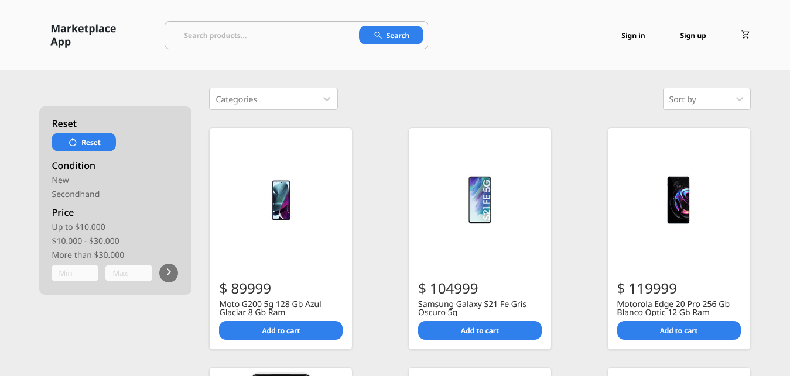
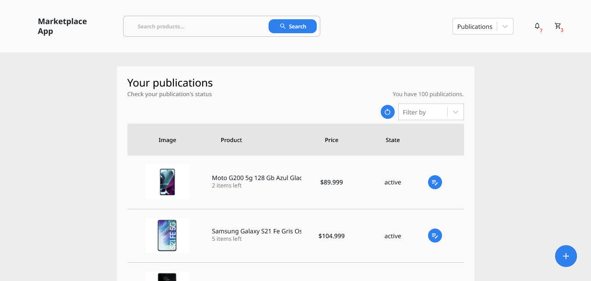
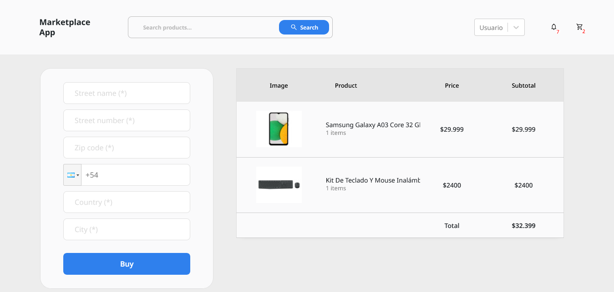
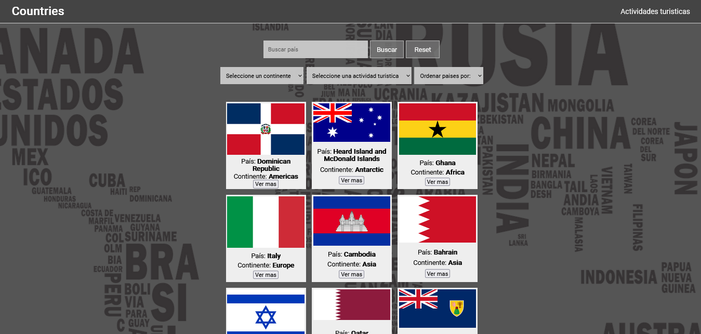

<!-- <h1 align="center"> Hi 👋, I'm Jonathan </h1>

<h3 align="center"> Full Stack Developer with orientation in the Front-end. </h2> -->

<!-- - 👨‍💻 Some of my projects are available at [https://jruizsilva.netlify.app](https://jruizsilva.netlify.app) -->

## _About Me_

  
Click to expand!

  
### Nice to virtually meet you!  
Hello, my name's Bethany Thompson.🤝 I graduated from Codeup, a fully-immersive, project-based Data Science career accelerator. Now, I work as a Database Analyst Associate at GDIT.

The data isn't always (~more like never~) easy on the eyes, but I make sure the final project is. I am drawn to the visual side of data, such as creating interactive Tableau Storybooks and presentations that keep the audience drawn in.

I'm a certified Tableau Desktop Specialist! My current goals include:

- [ ] Become a Tableau Desktop Certified Associate
- [ ] Pass the PSM1 certification
- [ ] Push to GitHub at least once a week

My personal interests include reading a good science fiction book, listening to music, and rollerskating (_very carefully_, knee pads and all). Most importantly, I love being creative in everything possible.

## Languages and Tools:

  
  
  
  
  
  
  
  
  
  
  
   
  

## Connect with me:

use ctrl + click for open in a new window

## Marketplace App

📌 Henry bootcamp final project.

🚀 Technologies:
React - Redux - NodeJS - Express - PostgreSQL - Sequelize

use ctrl + click for open the project in a new window

  
  

  
  

## Countries App

📌 Henry bootcamp individual project.

🚀 Technologies:
React - Redux - NodeJS - Express - PostgreSQL - Sequelize

use ctrl + click for open the project in a new window

  

